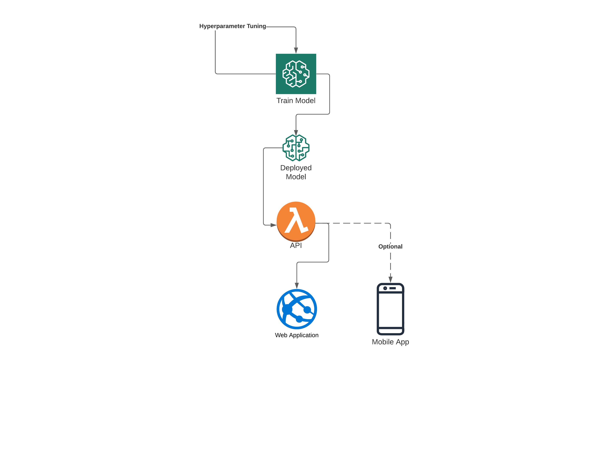

# Pneumonia Detection from the Chest X-ray Image

## Domain Background
Coronavirus disease is widely spread around the world in 2020. Coronavirus detection kit is limited as more people are getting infected than producing the Covid-19 diagnosis kit. The kit cost is much higher than developing countries like India, Nepal, Pakistan, and many African countries cannot afford it. These countries are still fighting with the diseases that spread by bugs and mosquitos like Malaria, Dengue, and many more. Covid-19 symptoms are variable, but majorly it includes fever and cough. Fever is most common among many diseases like Malaria, Covid-19, Dengue and others. To predict Covid-19 without using a Coronavirus detection kit is to check the amount of the cough present in the lungs. If a certain amount of cough increase in the lungs, it calls Pneumonia. So, Pneumonia detection might be helpful for the pre-stage of identifying Covid-19 patients. Pneumonia can be detected through the X-ray image of the chest or lungs.

## Problem Statement
As per the CDC, Coronavirus infected rate is near to 5. That means one infected person can transfer the Covid-19 virus to the other 5 persons. As an early detection, physicians are recommending doing Pneumonia test through chest X-ray. As a result of that, radiologists supposed to look more X-ray images and take a decision whether a patient has Pneumonia or not. A radiologist is also human, and human makes a mistake. Sometime this mistake has to pay off another human precious life. I can reduce mistake by providing assistant on Pneumonia detection to the radiologist. Artificial Intelligence (AI) has the potential to diagnose disease through image classification. As a part of this project, I am going to train the Machine Learning model which will detect the Pneumonia through chest X-ray image and providing a web application to the radiologist, who can upload the chest X-ray image and our Machine Learning algorithm diagnose Pneumonia disease.

## Datasets and Inputs
I am going to use a chest X-ray dataset from the Kaggle. This dataset has total of 5856 chest X- ray images. Among them, 4,273 images are marked as lungs are infected by Pneumonia and 1,583 images marked as healthy or normal lungs. I am using pixels of the image as an input feature of our machine learning model and I am going to use binary image classification to distinguish between Pneumonia infected lungs vs. normal healthy lungs.

## Solution Statement
As a part of the project, I am going to build the model which will classify or predict that given chest X-ray image has Pneumonia or not. This prediction will have greater than 75% accuracy on test data, so it will assist radiologists accurately.

## Project Design

## Documentations
- [Proposal](https://github.com/harshjk/pneumonia-detection/blob/master/Documentation/proposal.pdf)
- [Project Report](https://github.com/harshjk/pneumonia-detection/blob/master/Documentation/Pneumonia%20Detection%20-%20Report.pdf)
- [Proposal Review](https://review.udacity.com/#!/reviews/2493582)

## Python Notebook
[Python notebook](https://github.com/harshjk/pneumonia-detection/blob/master/Pneumonia%20Detection.ipynb) is compatible with the Amazon SageMaker compatible, no external library are require to install to run this project.

## Web Application
In order to run [Web Application](https://github.com/harshjk/pneumonia-detection/tree/master/website), need to replace `fire_ajax_submit` url variable from the AWS lambda deployed URL.
